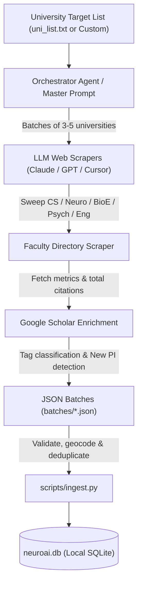

# Find Your Advisor 🎓

> **An Autonomous Academic PI Discovery, Bibliometric Intelligence & Application CRM Platform**  
> *Empowering prospective PhD students and postdocs to discover research advisors, track lab openings, and manage application outreach pipelines.*

<p align="center">
  
</p>

<p align="center">
  <a href="#features"></a>
  <a href="#architecture"></a>
  <a href="#gis-map-explorer"></a>
  <a href="#universal-ai-agent-mining-workflow"></a>
  <a href="LICENSE"></a>
</p>

---

## 📖 English Introduction

Applying for PhD or postdoctoral positions across academia (**Robotics, Quantum Computing, NLP, Computational Biology, NeuroAI, Materials Science, Economics, etc.**) is notoriously challenging. Frontier research is scattered across fragmented departments—Computer Science, Engineering, Natural Sciences, Medicine, and specialized interdisciplinary institutes. Crucial recruitment intelligence—such as lab opening years (New PIs with fresh funding), Google Scholar metrics, personal impressions, and application progress—frequently gets lost in disjointed spreadsheets.

**Find Your Advisor** is a modern, local-first academic advisor discovery and application CRM platform. Designed to be **completely discipline-agnostic and institution-flexible**, it allows you to input any academic field and target university list. It pairs a high-performance web interface and GIS map explorer with an autonomous **Multi-Agent AI Mining Workflow** (compatible with ChatGPT, Claude, Cursor, Windsurf, and custom LLM agents) that automatically crawls multidisciplinary department directories, extracts faculty credentials and bibliometrics, and maintains a clean, deduplicated SQLite database on your local machine.

---

## 🇨🇳 中文简介

在学术界（如 **机器人与具身智能、量子计算、大语言模型与 NLP、计算生物学、神经科学/NeuroAI、新材料、经济金融等任意学科**）寻找博士导师或博后岗位往往面临巨大挑战。前沿研究分散在不同的学院、交叉学科研究所与附属中心中。导师实验室成立年份（拥有启动经费与招生指标的新 PI）、Google Scholar 引用与 H-index、邮件联系进度与套瓷日志经常散落在 Excel 与笔记软件中，难以系统复盘。

**Find Your Advisor** 是一款完全本地化、隐私友好且**不限学科、不限院校名单**的通用学术导师发现与申请 CRM 平台。它提供现代化的交互界面、ESRI 全球地理 GIS 地图探索和带 `@导师` 智能提及的双向套瓷日记，并完整内置了支持 **ChatGPT (GPT-4o/5)、Claude (3.5 Sonnet)、Cursor 及各类主流 LLM Agent** 的通用多智能体数据挖掘工作流，支持由用户自定义输入目标学科、研究关键词与院校清单，自主进行多学院深度穿透挖掘、自动化提取学者引用并建立结构化本地数据库。

---

## ✨ Key Features / 核心功能

### 1. 🔬 Multidisciplinary Taxonomy & Boolean Filtering (跨学科多维筛选)
- **Methods Filtering**: `NeuroAI / Machine Learning`, `Brain Modeling`, `BCI`, `Electrophysiology`, `Optical Imaging`, `Neuroimaging`, `Neuromodulation`, `Genomics / Bioinformatics`, `SNN / Neuromorphic`.
- **Domains Filtering**: `Visual`, `Motor`, `Memory`, `Decision Making`, `Attention`, `Auditory`, `Linguistic`, `Emotion / Social`, `Sleep / Circadian`, `Disease / Clinical`.
- Flexible **AND / OR logic** toggle for complex intersection queries.

### 2. 🚀 New PI & Incoming PI Radar (新晋 PI 招生雷达)
- Identifies newly established labs (**2025 / 2026**) with distinctive orange badges.
- Detects upcoming faculty recruited for **2027** (Incoming PIs) with high-visibility pink badges.
- Quickly targets faculty members with maximum recruitment intent and available startup funding.

### 3. 🗺️ Interactive GIS Map Explorer (全球大学分布地图)
- Powered by Leaflet & high-resolution ESRI topographic vector tiles.
- Pre-seeded with **106 top research universities** across North America, Europe, and Asia.
- Country quick-jump buttons and dynamic clustering.
- Interactive university badges with visual indicators for starred priority PIs (pulsing gold ring) and active outreach pipelines (emerald green).
- Direct bidirectional flying: click on any university in a card to instantly fly the camera to its campus marker on the globe.

### 4. 📋 Application Pipeline CRM & Outreach Journal (申请套瓷 CRM 与工作日记)
- **Outreach Pipeline Stages**: `Uncontacted`, `Reading Papers`, `Drafting Email`, `Contacted`, `Replied - Positive`, `Replied - Negative`, `Interview`, `Offer`, `Rejected`.
- **Priority Ratings**: 1 to 5 gold stars for ranking dream labs.
- **Outreach Journal**: Daily log, weekly review, and monthly report tracking.
- **Smart `@` Professor Mention Badges**: Type `@` in the journal to auto-suggest professors; creates interactive clickable pills that navigate directly to the professor's card and records bi-directional communication history.
- **Global Batch Management**: Clean top-bar selection for single-click card editing and deletion.

### 5. ⚡ Zero-Dependency Lightweight Architecture (零依赖架构)
- **Vanilla Python Standard Library**: Built strictly using `http.server`, `sqlite3`, `urllib`, and `json`.
- **Zero pip install required**: No Node.js, no Docker, no external database servers. Runs out of the box on Windows, macOS, and Linux.

### 6. 🔒 100% Privacy & Local-First (数据私密性保证)
- Your contact history, personal ratings, and notes are stored strictly in a local SQLite file (`neuroai.db`).
- Nothing is uploaded to third-party clouds or telemetry servers.

---

## 🚀 Quick Start / 快速开始 (30 Seconds)

### Prerequisites
- Python 3.8 or higher.
- A modern web browser (Chrome, Edge, Firefox, Safari).

### 1. Clone the Repository
```bash
git clone https://github.com/YuhaoWei523/Find_Your_Advisor.git
cd Find_Your_Advisor
```

### 2. Start the Server
```bash
python app.py
```

*Note: On the first run, `app.py` automatically initializes `neuroai.db` and populates the 106 global research universities and their geographic coordinates.*

### 3. Open in Browser
Visit:
```
http://localhost:5000
```
or open `index.html` directly in your browser.

---

## 🤖 Universal AI Agent Mining Workflow (ChatGPT • Claude • Cursor • Any LLM)

The repository provides a complete, model-agnostic academic discovery framework in [`.agents/skills/advisor-data-miner/`](.agents/skills/advisor-data-miner/SKILL.md) and ready-to-copy prompt recipes in [`AI_AGENT_GUIDE.md`](AI_AGENT_GUIDE.md).

```
Find_Your_Advisor/
├── AI_AGENT_GUIDE.md         # Ready-to-copy prompts for Claude, ChatGPT & Cursor
└── .agents/skills/advisor-data-miner/
    ├── SKILL.md              # Universal agent instruction runbook
    ├── scripts/
    │   └── ingest.py         # Robust JSON to SQLite validation & ingestion engine
    ├── examples/
    │   └── sample_batch.json # Standardized JSON data format reference
    └── references/
        └── schema.md         # Full database schema and taxonomy reference
```

### How the Mining Workflow Works



### 🎯 Fast Setup with Popular AI Assistants

- **Anthropic Claude (Claude 3.5 Sonnet / Claude Projects)**:
  - Copy the system prompt from [`AI_AGENT_GUIDE.md`](AI_AGENT_GUIDE.md) into your Claude Project or chat, specify your discipline and target university, and ask Claude to output researcher JSON.
- **OpenAI ChatGPT (GPT-4o / GPT-5 with Web Browsing)**:
  - Paste the prompt recipe from [`AI_AGENT_GUIDE.md`](AI_AGENT_GUIDE.md) into ChatGPT with browsing enabled to automatically search faculty profiles and Scholar bibliometrics.
- **AI Coding Agents (Cursor / Windsurf / Cline / Aider)**:
  - Prompt your coding agent to read `uni_list.txt`, sweep universities in batches, save JSON files to `batches/`, and run `scripts/ingest.py`.

### Automated Ingestion into SQLite
Whenever your AI agent generates researcher JSON files:
```bash
# Ingest an entire directory of JSON files
python .agents/skills/advisor-data-miner/scripts/ingest.py --json-dir ./batches/ --db neuroai.db

# Ingest a single JSON file
python .agents/skills/advisor-data-miner/scripts/ingest.py --file ./sample.json --db neuroai.db
```

The ingestion engine automatically:
1. Validates the JSON schema.
2. Dynamically registers any new universities into the database and inherits GIS coordinates.
3. Deduplicates on `(LOWER(Name), LOWER(University))`.
4. Merges newly scraped profile fields without altering your personal CRM ratings or outreach notes.

---

## 📂 Project Directory Structure

```text
Find_Your_Advisor/
├── index.html                   # Modern responsive frontend SPA
├── app.py                       # Zero-dependency Python HTTP & REST API server
├── init_db.py                   # Standalone database initialization script
├── seed_universities.json       # Geocoordinates & country data for 106 universities
├── uni_list.txt                 # Canonical list of target universities
├── AI_AGENT_GUIDE.md            # Ready-to-copy prompts for Claude, ChatGPT & Cursor
├── .gitignore                   # Strict rules protecting personal database & notes
├── LICENSE                      # MIT Open Source License
├── README.md                    # Project documentation
├── web_assets/
│   ├── app.js                   # Application logic, Leaflet GIS, & mention system
│   └── logo.jpg                 # Brand logo
└── .agents/
    └── skills/
        └── advisor-data-miner/  # Universal data collection skill package
            ├── SKILL.md
            ├── scripts/ingest.py
            ├── examples/sample_batch.json
            └── references/schema.md
```

---

## 🛠️ API Reference

| Endpoint | Method | Description |
| :--- | :--- | :--- |
| `GET /api/tags` | GET | Returns available methods, domains, countries, and universities. |
| `GET /api/researchers` | GET | Filter researchers by search keywords, methods, domains, universities, statuses, priorities, and PI status. |
| `GET /api/universities` | GET | Returns list of all universities with IDs. |
| `GET /api/logs` | GET | Returns outreach journal entries sorted by date. |
| `GET /api/researchers/history`| GET | Returns outreach log history specifically mentioning a given researcher ID. |
| `POST /api/researchers/update`| POST | Updates researcher fields (status, notes, priority, lab details). |
| `POST /api/researchers/add` | POST | Manually adds a new researcher profile. |
| `POST /api/researchers/delete`| POST | Deletes a researcher from the database. |
| `POST /api/logs/save` | POST | Creates or updates an outreach log entry and synchronizes `@` mentions. |
| `POST /api/logs/delete` | POST | Deletes an outreach log entry. |

---

## 🤝 Contributing

Contributions, bug reports, and feature requests are welcome!
1. Fork the Project.
2. Create your Feature Branch (`git checkout -b feature/AmazingFeature`).
3. Commit your Changes (`git commit -m 'Add some AmazingFeature'`).
4. Push to the Branch (`git push origin feature/AmazingFeature`).
5. Open a Pull Request.

---

## 📄 License

Distributed under the **MIT License**. See [`LICENSE`](LICENSE) for more information.

---

<p align="center">
  Built with ❤️ for academic researchers and aspiring scholars worldwide.
</p>
