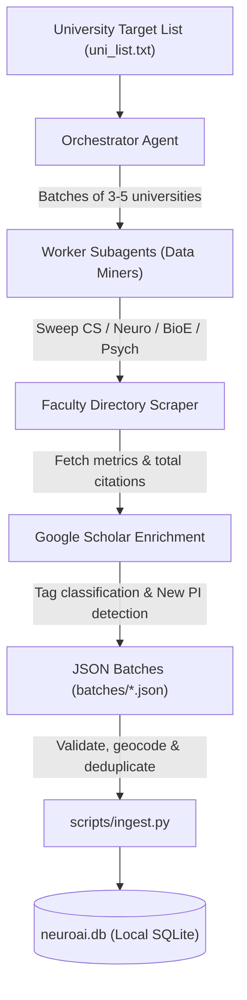

# Find Your Advisor 🎓

> **An Autonomous Academic PI Discovery, Bibliometric Intelligence & Application CRM Platform**  
> *Empowering prospective PhD students and postdocs to discover research advisors, track lab openings, and manage application outreach pipelines.*

<p align="center">
  
</p>

<p align="center">
  <a href="#features"></a>
  <a href="#architecture"></a>
  <a href="#gis-map-explorer"></a>
  <a href="#advisor-data-miner-skill"></a>
  <a href="LICENSE"></a>
</p>

---

## 📖 English Introduction

Applying for PhD or postdoctoral positions in multidisciplinary fields (e.g., **NeuroAI, Computational Neuroscience, Brain-Computer Interfaces, Neuroengineering, Cognitive AI**) is notoriously complex. Research faculty are distributed across disconnected departments—Computer Science, Bioengineering, Neuroscience, Psychology, and Medical Imaging institutes. Tracking lab opening years (New PIs with fresh funding), Google Scholar metrics, personal notes, and email correspondence typically results in chaotic, disjointed spreadsheets.

**Find Your Advisor** is a modern, local-first academic discovery platform and application CRM. It pairs a high-performance web interface and GIS map explorer with an autonomous **Antigravity Multi-Agent Mining Skill** that automatically crawls department directories, extracts faculty credentials and bibliometrics, and maintains a clean, deduplicated SQLite database on your local machine.

---

## 🇨🇳 中文简介

在跨学科前沿领域（如 **NeuroAI、计算神经科学、脑机接口 BCI、神经工程、认知智能**）寻找博士生导师或博后岗位往往面临巨大挑战。教授们分散在计算机系（CS/AI）、生物医学工程系（BME）、脑与认知科学系（BCS/Neuroscience）、心理学系以及各大神经疾病医学研究所中。此外，课题组成立年份（拥有启动经费与大量招生名额的新 PI）、Google Scholar 引用数与 H-index、邮件联系进度与套瓷日志经常散落在 Excel 与笔记软件中，难以系统复盘。

**Find Your Advisor** 是一款完全本地化、隐私友好的学术导师雷达与申请 CRM 平台。它不仅提供现代化的交互界面、ESRI 全球地理 GIS 地图探索和带 `@导师` 智能提及的双向套瓷日记，还完整内置了基于 **Google Antigravity** 的多智能体爬虫与挖掘 Skill，能够自主按大学/系所深挖教授信息、自动化提取学者引用并建立结构化本地数据库。

---

## ✨ Key Features / 核心功能

### 1. 🔬 Multidisciplinary Taxonomy & Boolean Filtering (跨学科多维筛选)
- **Methods Filtering**: `NeuroAI / Machine Learning`, `Brain Modeling`, `BCI`, `Electrophysiology`, `Optical Imaging`, `Neuroimaging`, `Neuromodulation`, `Genomics / Bioinformatics`, `SNN / Neuromorphic`.
- **Domains Filtering**: `Visual`, `Motor`, `Memory`, `Decision Making`, `Attention`, `Auditory`, `Linguistic`, `Emotion / Social`, `Sleep / Circadian`, `Disease / Clinical`.
- Flexible **AND / OR logic** toggle for complex intersection queries.

### 2. 🚀 New PI & Incoming PI Radar (新晋 PI 招生雷达)
- Identifies newly established labs (**2025 / 2026**) with distinctive orange badges.
- Detects upcoming faculty recruited for **2027** (Incoming PIs) with high-visibility pink badges.
- Quickly targets faculty members with maximum recruitment intent and available startup funding.

### 3. 🗺️ Interactive GIS Map Explorer (全球大学分布地图)
- Powered by Leaflet & high-resolution ESRI topographic vector tiles.
- Pre-seeded with **106 top research universities** across North America, Europe, and Asia.
- Country quick-jump buttons and dynamic clustering.
- Interactive university badges with visual indicators for starred priority PIs (pulsing gold ring) and active outreach pipelines (emerald green).
- Direct bidirectional flying: click on any university in a card to instantly fly the camera to its campus marker on the globe.

### 4. 📋 Application Pipeline CRM & Outreach Journal (申请套瓷 CRM 与工作日记)
- **Outreach Pipeline Stages**: `Uncontacted`, `Reading Papers`, `Drafting Email`, `Contacted`, `Replied - Positive`, `Replied - Negative`, `Interview`, `Offer`, `Rejected`.
- **Priority Ratings**: 1 to 5 gold stars for ranking dream labs.
- **Outreach Journal**: Daily log, weekly review, and monthly report tracking.
- **Smart `@` Professor Mention Badges**: Type `@` in the journal to auto-suggest professors; creates interactive clickable pills that navigate directly to the professor's card and records bi-directional communication history.
- **Global Batch Management**: Clean top-bar selection for single-click card editing and deletion.

### 5. ⚡ Zero-Dependency Lightweight Architecture (零依赖架构)
- **Vanilla Python Standard Library**: Built strictly using `http.server`, `sqlite3`, `urllib`, and `json`.
- **Zero pip install required**: No Node.js, no Docker, no external database servers. Runs out of the box on Windows, macOS, and Linux.

### 6. 🔒 100% Privacy & Local-First (数据私密性保证)
- Your contact history, personal ratings, and notes are stored strictly in a local SQLite file (`neuroai.db`).
- Nothing is uploaded to third-party clouds or telemetry servers.

---

## 🚀 Quick Start / 快速开始 (30 Seconds)

### Prerequisites
- Python 3.8 or higher.
- A modern web browser (Chrome, Edge, Firefox, Safari).

### 1. Clone the Repository
```bash
git clone https://github.com/YuhaoWei523/Find_Your_Advisor.git
cd Find_Your_Advisor
```

### 2. Start the Server
```bash
python app.py
```

*Note: On the first run, `app.py` automatically initializes `neuroai.db` and populates the 106 global research universities and their geographic coordinates.*

### 3. Open in Browser
Visit:
```
http://localhost:5000
```
or open `index.html` directly in your browser.

---

## 🤖 Autonomous Data Mining Skill (`advisor-data-miner`)

The repository includes a ready-to-run **Antigravity Skill** in [`.agents/skills/advisor-data-miner/`](.agents/skills/advisor-data-miner/SKILL.md).

```
.agents/skills/advisor-data-miner/
├── SKILL.md                  # Comprehensive agent instruction guide
├── scripts/
│   └── ingest.py             # Robust JSON to SQLite validation & ingestion engine
├── examples/
│   └── sample_batch.json     # Standardized JSON data format reference
└── references/
    └── schema.md             # Full database schema and taxonomy reference
```

### How the Mining Workflow Works



### Triggering the Skill in Antigravity
You can ask your Antigravity assistant:
> *"Use the `advisor-data-miner` skill to search for faculty working on Brain-Computer Interfaces and NeuroAI across Oxford, Cambridge, and Imperial College London, and ingest the results into my database."*

### Manual Ingestion of Custom Crawled Batches
If you have generated JSON researcher files via custom scripts or AI agents:
```bash
# Ingest an entire directory of JSON files
python .agents/skills/advisor-data-miner/scripts/ingest.py --json-dir ./batches/ --db neuroai.db

# Ingest a single JSON file
python .agents/skills/advisor-data-miner/scripts/ingest.py --file ./sample.json --db neuroai.db
```

The ingestion engine automatically:
1. Validates the JSON schema.
2. Matches the university against the GIS coordinates database.
3. Deduplicates on `(LOWER(Name), LOWER(University))`.
4. Merges newly scraped profile fields without altering your personal CRM ratings or outreach notes.

---

## 📂 Project Directory Structure

```text
Find_Your_Advisor/
├── index.html                   # Modern responsive frontend SPA
├── app.py                       # Zero-dependency Python HTTP & REST API server
├── init_db.py                   # Standalone database initialization script
├── seed_universities.json       # Geocoordinates & country data for 106 universities
├── uni_list.txt                 # Canonical list of target universities
├── .gitignore                   # Strict rules protecting personal database & notes
├── LICENSE                      # MIT Open Source License
├── README.md                    # Project documentation
├── web_assets/
│   ├── app.js                   # Application logic, Leaflet GIS, & mention system
│   └── logo.jpg                 # Brand logo
└── .agents/
    └── skills/
        └── advisor-data-miner/  # Complete Antigravity data collection skill package
            ├── SKILL.md
            ├── scripts/ingest.py
            ├── examples/sample_batch.json
            └── references/schema.md
```

---

## 🛠️ API Reference

| Endpoint | Method | Description |
| :--- | :--- | :--- |
| `GET /api/tags` | GET | Returns available methods, domains, countries, and universities. |
| `GET /api/researchers` | GET | Filter researchers by search keywords, methods, domains, universities, statuses, priorities, and PI status. |
| `GET /api/universities` | GET | Returns list of all universities with IDs. |
| `GET /api/logs` | GET | Returns outreach journal entries sorted by date. |
| `GET /api/researchers/history`| GET | Returns outreach log history specifically mentioning a given researcher ID. |
| `POST /api/researchers/update`| POST | Updates researcher fields (status, notes, priority, lab details). |
| `POST /api/researchers/add` | POST | Manually adds a new researcher profile. |
| `POST /api/researchers/delete`| POST | Deletes a researcher from the database. |
| `POST /api/logs/save` | POST | Creates or updates an outreach log entry and synchronizes `@` mentions. |
| `POST /api/logs/delete` | POST | Deletes an outreach log entry. |

---

## 🤝 Contributing

Contributions, bug reports, and feature requests are welcome!
1. Fork the Project.
2. Create your Feature Branch (`git checkout -b feature/AmazingFeature`).
3. Commit your Changes (`git commit -m 'Add some AmazingFeature'`).
4. Push to the Branch (`git push origin feature/AmazingFeature`).
5. Open a Pull Request.

---

## 📄 License

Distributed under the **MIT License**. See [`LICENSE`](LICENSE) for more information.

---

<p align="center">
  Built with ❤️ for academic researchers and aspiring scholars worldwide.
</p>
